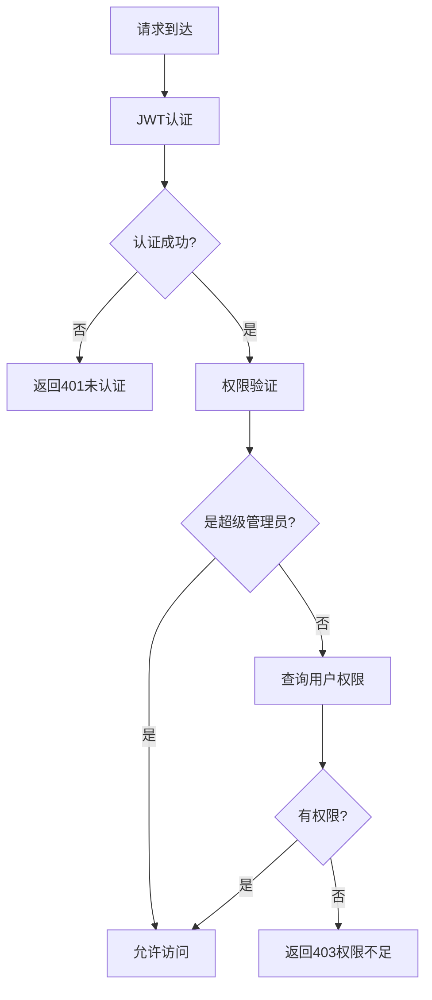

# RBAC权限管理系统详解

## 📖 概述

本系统实现了完整的RBAC（基于角色的访问控制）权限管理机制，支持细粒度的权限控制，确保不同角色的用户只能访问其被授权的资源。

## 🏗️ 权限架构

### 1. **数据模型关系**

```
用户(User) ←→ 用户角色(UserRole) ←→ 角色(Role) ←→ 角色权限(RolePermission) ←→ 权限(Permission)
```

- **用户**: 系统的实际使用者
- **角色**: 权限的集合，如超级管理员、管理员、普通用户
- **权限**: 具体的操作权限，如查看用户列表、创建用户等
- **关联表**: 实现多对多关系

### 2. **权限类型**

| 类型 | 说明 | 示例 |
|------|------|------|
| `api` | API接口权限 | `user:list`, `user:create` |
| `menu` | 菜单访问权限 | `menu:user`, `menu:role` |
| `button` | 按钮操作权限 | `button:export`, `button:import` |

## 👥 默认角色体系

### 1. **超级管理员 (super_admin)**
- **权限范围**: 拥有系统所有权限
- **特殊性**: 绕过权限检查，自动拥有所有权限
- **适用场景**: 系统维护、权限管理、敏感操作

### 2. **管理员 (admin)**
- **权限范围**: 大部分管理权限，但不包括权限管理
- **限制**: 不能创建/修改/删除权限，不能清空操作日志
- **适用场景**: 日常管理工作、用户管理、角色管理

### 3. **普通用户 (user)**
- **权限范围**: 基本查看权限
- **限制**: 只能查看，不能进行增删改操作
- **适用场景**: 一般业务用户

### 4. **访客 (guest)**
- **权限范围**: 最小权限集合
- **限制**: 只能查看部分基础信息
- **适用场景**: 临时访问、演示账号

## 🔐 权限验证机制

### 1. **中间件层次**

```go
// 认证中间件（第一层）
AuthMiddleware() // 验证JWT token，确认用户身份

// 权限中间件（第二层）
RequirePermission("user:list") // 验证具体权限
RequireRole("admin")           // 验证角色
RequireSuperAdmin()           // 验证超级管理员
RequireAdmin()                // 验证管理员（包括超级管理员）
```

### 2. **权限检查流程**



## 📋 权限代码规范

### 1. **命名规则**

```
模块:操作
user:list     # 用户列表
user:create   # 创建用户
user:update   # 更新用户
user:delete   # 删除用户
role:list     # 角色列表
permission:create # 创建权限
```

### 2. **权限分级**

| 级别 | 权限类型 | 示例 |
|------|----------|------|
| 查看 | `module:list`, `module:detail` | `user:list`, `user:detail` |
| 操作 | `module:create`, `module:update` | `user:create`, `user:update` |
| 危险 | `module:delete`, `module:clear` | `user:delete`, `logs:clear` |
| 系统 | `system:*`, `permission:*` | `system:setting`, `permission:create` |

## 🛠️ 使用方法

### 1. **在路由中使用权限控制**

```go
// 需要特定权限
userRouter.GET("", middleware.RequirePermission("user:list"), userApi.GetUserList)

// 需要特定角色
userRouter.POST("", middleware.RequireRole("admin", "super_admin"), userApi.CreateUser)

// 仅超级管理员
permissionRouter.POST("", middleware.RequireSuperAdmin(), permissionApi.CreatePermission)

// 管理员及以上
logRouter.DELETE("/:id", middleware.RequireAdmin(), logApi.DeleteLog)
```

### 2. **在代码中检查权限**

```go
// 检查用户权限
userID := c.Get("user_id").(uint)
if middleware.HasPermission(userID, "user:delete") {
    // 有权限，执行操作
}

// 检查用户角色
if middleware.HasRole(userID, "admin") {
    // 是管理员，执行操作
}

// 检查是否为超级管理员
if middleware.IsSuperAdmin(userID) {
    // 是超级管理员，执行操作
}
```

### 3. **获取用户权限信息**

```go
// 获取用户所有权限
permissions := middleware.GetUserPermissions(userID)

// 获取用户所有角色
roles := middleware.GetUserRoles(userID)
```

## 🔧 API接口

### 1. **权限检查接口**

```http
# 获取当前用户权限
GET /api/user/permissions

# 获取当前用户角色
GET /api/user/roles

# 获取当前用户信息（包含权限和角色）
GET /api/user/info

# 检查特定权限
GET /api/user/check-permission?permission=user:list

# 检查特定角色
GET /api/user/check-role?role=admin
```

### 2. **响应示例**

```json
// GET /api/user/info
{
  "errCode": 0,
  "errMsg": "success",
  "data": {
    "user_id": 1,
    "username": "admin",
    "permissions": ["user:list", "user:create", "role:list"],
    "roles": ["super_admin"],
    "is_super_admin": true
  }
}
```

## 🚀 权限分配策略

### 1. **超级管理员**
- 自动拥有所有权限
- 不需要显式分配权限
- 用于系统初始化和紧急维护

### 2. **管理员**
- 预设常用管理权限
- 可以管理用户和角色
- 不能管理权限和系统设置

### 3. **普通用户**
- 基础查看权限
- 可以查看自己的信息
- 可以修改自己的密码

### 4. **访客**
- 最小权限集合
- 只能查看公开信息
- 适用于演示环境

## 📊 权限管理最佳实践

### 1. **权限设计原则**
- **最小权限原则**: 用户只获得完成工作所需的最小权限
- **职责分离**: 不同角色承担不同职责
- **权限继承**: 高级角色包含低级角色的权限

### 2. **安全建议**
- 定期审查用户权限
- 及时回收离职员工权限
- 监控敏感操作
- 记录权限变更日志

### 3. **开发建议**
- 新功能默认需要权限验证
- 敏感操作需要更高权限
- 提供权限检查的便捷方法
- 权限代码要清晰易懂

## 🔍 故障排查

### 1. **常见问题**

**问题**: 用户无法访问某个接口
**排查步骤**:
1. 检查用户是否已登录
2. 检查用户是否有对应权限
3. 检查权限代码是否正确
4. 检查中间件是否正确配置

**问题**: 超级管理员无法访问
**排查步骤**:
1. 检查用户是否被分配了super_admin角色
2. 检查角色状态是否启用
3. 检查用户状态是否启用

### 2. **调试方法**

```go
// 在代码中添加调试信息
userID := c.Get("user_id").(uint)
permissions := middleware.GetUserPermissions(userID)
roles := middleware.GetUserRoles(userID)
logger.Info("用户权限调试: userID=%d, permissions=%v, roles=%v", userID, permissions, roles)
```

## 📈 扩展功能

### 1. **动态权限**
- 支持运行时添加新权限
- 支持权限的启用/禁用
- 支持权限的批量操作

### 2. **权限缓存**
- 可以添加Redis缓存提高性能
- 支持权限变更时的缓存刷新

### 3. **权限审计**
- 记录权限变更历史
- 生成权限使用报告
- 监控异常权限操作

这个RBAC系统为你的应用提供了企业级的权限管理能力，确保系统安全性和可维护性！
